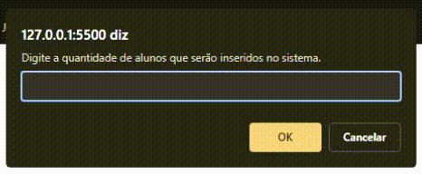

# Explorer | Stage 04 - Exercício 02

Exercício de JavaScript sobre estrutura de dados e funções

## Desafio solicitado

Nesse desafio você irá criar uma lista de **estudantes** e, cada estudante dentro dessa lista, deverá conter os seguintes dados:

-   nome;
-   nota da primeira prova;
-   nota da segunda prova.

Depois de criada a lista:

-   [x] Crie uma **função** que irá calcular a média das notas de cada aluno;
-   [x] Supondo que a média, para esse concurso é **7**, verifique **se** cada aluno obteve sucesso ou não em entrar no concurso e mostre uma mensagem na tela.

